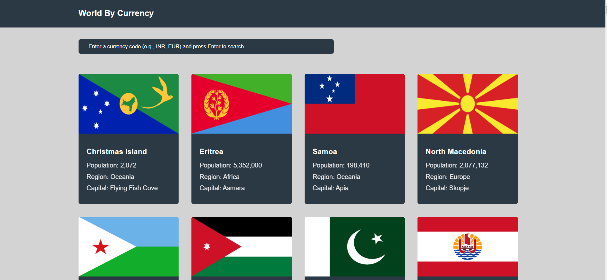
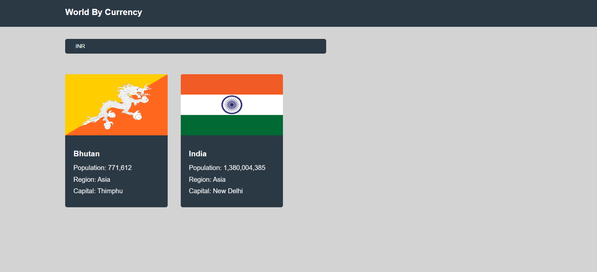
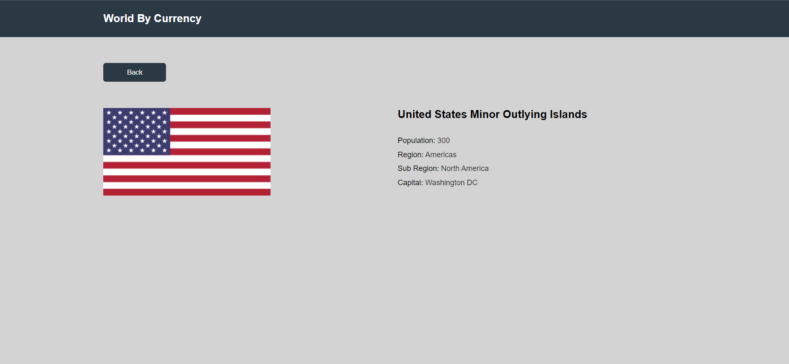
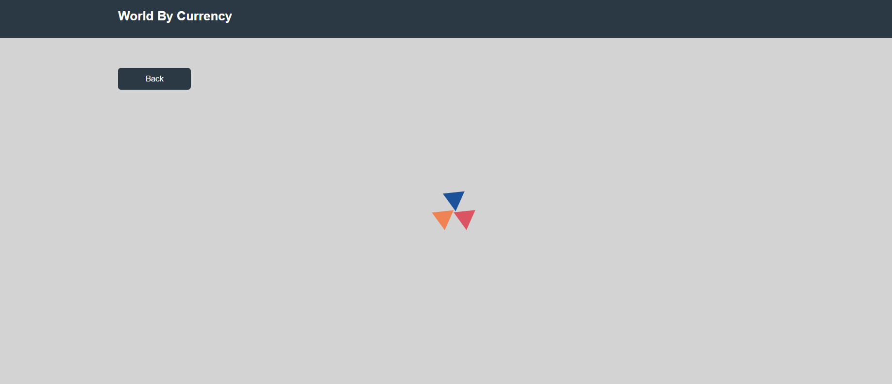

# World Of Currency React application

## Description
I've developed a simple yet effective web page that includes a user-friendly search bar designed specifically for identifying countries associated with a given currency. The primary focus is on providing a straightforward and intuitive user experience.

## Tech Stack
**Frontend**: React.js, React Router DOM, CSS3, HTML5    
**Deployed On**: Vercel
"https://metta-social-worldofcurrency.vercel.app/"

## Features
1. Search Bar:
    The centerpiece of the web page is a dedicated search bar.
    Users can input a currency code or name to initiate the search process.
   
3. Responsive Design:
    The web page is designed to be responsive, ensuring a seamless experience across various devices and screen sizes.
   
5. UI:
    The user interface is crafted for clarity and simplicity.
   
6. Loader for Smooth Interaction:
    To enhance the user experience, a loader is implemented, ensuring that users are aware of ongoing processes during searches.
   
   
   
   
       

## Installation

To run the WorldOfCurrency locally, follow these steps:

1. Clone the repository:

   ```
   git clone https://github.com/NainaPremani/WorldOfCurrency.git
   ```

2. Navigate to the project directory:

   ```
   cd WorldOfCurrency
   ```

3. Install the required dependencies:

   ```
   npm install
   ```

4. Start the application:

   ```
   npm run dev
   ```


  
